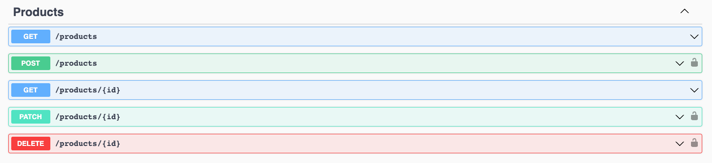

# Spellbook NestJS Test

Hey 👋 Welcome to Spellbook's NestJS Test - v1. The goal of this exercise is to determine your level of understanding of NestJS at a fundamental level. This test is intended for mid-level developers.

## The App

This repository contains the foundations of an e-commerce web application. The `user` and `product` table have both been setup ahead of time.

The Swagger documentation has been setup at http://localhost:3000/api. Feel free to visit it after setting up the project.

The additional functionality that you will need to build should take less than 4 hours to build without additional research and learning time.

## Objectives

1. Add JWT Auth Strategy & JWT Auth Guard.

   - All endpoints, except from those under the `/auth` path, require a signed in user.

2. Add the ability to filter Products via query strings.

   ```
   /products?name=Name&price_subunit[gte]=10&price_subunit[lte]=100
   ```

   - `name` filters products by products containing the provided value in the product name.
   - `price_subunit[gte]` filters products by product costing more than or equal the provided value.
   - `price_subunit[lte]` filters products by product costing less than or equal the provided value.

   With `price_subunit[gte]` and `price_subunit[lte]` together, we should be able to get products priced within a range.

3. Extend the `products#update` controller action to accept a Many-To-Many relation to `categories`.

   - The `products#show` and `products#update` controller actions should return the product's categories. The `products#index` action should not.

To assist with the objectives given, TODOs, such as below, have been scattered throughout the project for your reference.

```js
/*
 * TODO: Return current user
 */
```

Anything outside of the objectives listed above are not required for submission.

For example, you do not _need_ to add in the Swagger documentation for the changes you make, although it may help you with your process.

## What we're looking for

We want to see that you can create a clean and maintainable NestJS codebase. This exercise focuses on fundamentals and everyday challenges. Attention to detail is something we value for our take-home tests. 😉

## Submission

Once you are complete with the tasks above, please push your code to your public GitHub profile and send us the link! We'll have a look and get back to you as soon as we can!
